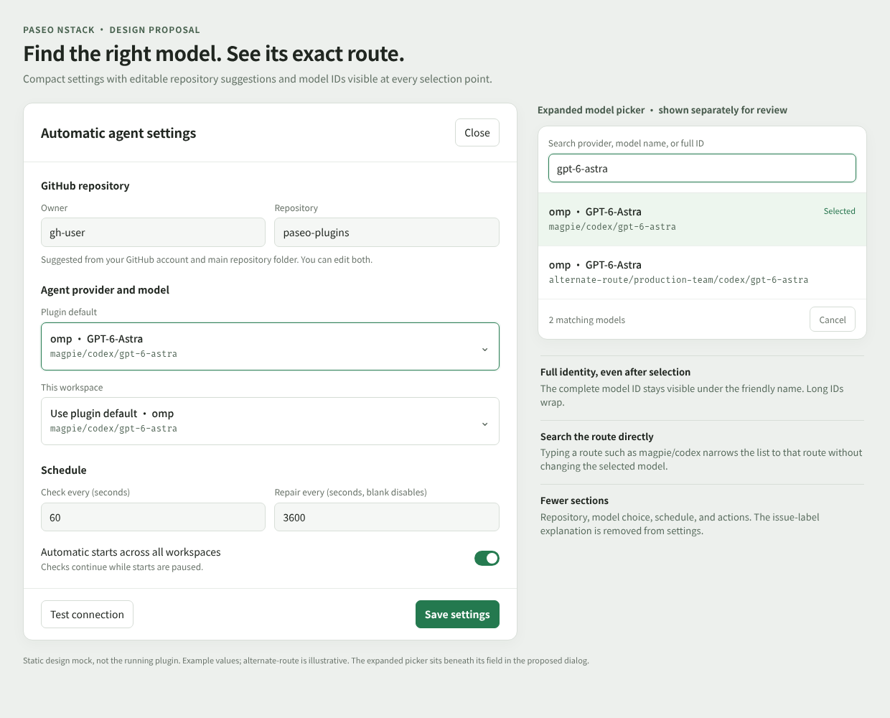

# Design: nstack settings revamp

Status: design-proposed; scope confirmed on 2026-10-10. Implementation is approved when the owner merges the design PR; no merge is recorded yet.

Grounding: local Issues-label workflow commit `6edcc54507b6fc8a5d405fab04b920e9a2156d63`, which is not yet on `origin/main`. Both implementation slices require that workflow to land first. This PR contains only the settings design artifacts.

Intake: [_intake/paseo-nstack-settings-grill.md](_intake/paseo-nstack-settings-grill.md). Issue: none filed. Prototype: none. Scaffold: none.

Artifact: [desktop mock](assets/paseo-nstack-settings/overview.png), [narrow mock](assets/paseo-nstack-settings/narrow.png), [reproducible HTML](assets/paseo-nstack-settings/settings.html). These are intended UI, not screenshots of an implemented feature. Example model routes are explicitly illustrative.

Glossary: existing GLOSSARY.md; no new terms. ADRs: none; these local, reversible decisions do not meet the ADR threshold.

Method: nstack-design; mattpocock/skills @ b0618bc, codebase-design and to-tickets. Alternatives compared inline; no workers dispatched.

## 1. Problem and done

Settings currently repeats the entire model catalog in two chip grids. Friendly labels hide the model IDs, so different OMP routes can both appear as `omp · GPT-6-Astra`. New bindings require manual owner/repository entry, and explanatory issue-label text occupies space without offering a setting.

Done means a user can search either model selector, distinguish and save the exact model route even when names collide, open a new binding with editable GitHub-user/main-folder suggestions, and complete settings without an Issue labels section.

Constraints grounded in the checkout:

- `server/spawn.ts` already returns `{ provider, model, label, supportsWrite }`. `model` is the complete provider-supplied ID; launch selection uses the exact provider/model pair.
- `client/panel.tsx` currently renders only `option.label`. Saved model-choice and repository schemas already represent the intended values.
- `nstack.panel` polls every five seconds. It must not become a periodic GitHub-identity lookup.
- GitHub identity is available through `github.login()`. `paseo.workspaces.ref(workspaceId).refresh()` returns `projectRootPath` and `workspaceDirectory` in SDK 0.10.2.
- The settings surface uses React Native primitives and host theme tokens. Preserve desktop, narrow layout, keyboard, and native support.

Non-goals: model discovery changes, new model routes, provider configuration, schedules or permissions, issue-label workflow changes, automatic repository creation, and the separate Paseo 0.10.2 timeline-persistence limitation.

## 2. Usage

1. Open settings for a new binding. Owner is suggested from the authenticated GitHub account; Repository from the main project root folder. In a `settings-revamp` worktree of `paseo-plugins`, the suggestion remains `gh-username/paseo-plugins`. Both fields are editable and nothing is saved until Save settings.
2. Open Plugin default. Search `gpt-6-astra` to see matching models, or `magpie/codex` to find that route. Each result shows its friendly label and full ID; choosing a result keeps both visible in the collapsed field.
3. Open This workspace. Choose a specific model or Use plugin default. Inheritance remains stored as `null`; the collapsed field displays the effective default ID without copying it into a workspace override.

The expanded picker is separated in the artwork for review. In the product it expands directly beneath its owning field, with a bounded scrollable results area. The existing dialog remains the settings surface.

## 3. Strategy

### Settled decisions

- D1 — user-approved: both selectors are searchable; retain Use plugin default.
- D2 — user-approved: show and search the full model ID on every result and selected value; wrap long IDs and distinguish identical friendly labels.
- D3 — user-approved: new-binding defaults use the authenticated GitHub username and main repository folder, including worktrees.
- D4 — user-approved: preserve saved values and anything the user has already typed or cleared.
- D5 — user-approved: remove the Issue labels section from settings.

### Proposed interaction and interfaces

P1: Replace both chip grids with one reusable client-only `ModelPicker` module. Its interface takes the label, theme, existing options, exact selected choice, change callback, expanded state, and optional inheritance choice. The settings dialog owns which field is expanded; the module owns query text, filtered results, keyboard navigation, and rendering. Opening one closes the other. Both callers use the existing `ProviderChoice` and `PanelState["providerOptions"]` types.

P2: Search is local, case-insensitive, and whitespace-tokenized. Every query token must occur in the combined friendly label, provider, or full model ID. Preserve catalog order; no fuzzy-search dependency or network request per keystroke. Opening resets the query. Typing or cancelling never changes selection. The inheritance action stays separate from filtered model results. Empty matches show “No matching models.” Results without write support remain disabled. A provider-default option with `model: null` says “Provider default”; it does not invent an ID. An unavailable saved choice stays visible with its exact ID and an unavailable indication instead of silently choosing another model.

P3: Render the friendly label above a selectable, wrapping monospace full ID. Keep the literal ID intact when persisting; never use a label or search-normalized value as identity. Use full IDs in accessible labels too. Arrow keys move between enabled results; Enter chooses, Escape cancels, and focus returns to the owning field. Touch selection works through the same change callback. The inherited selection displays its effective provider and full model ID, or “No plugin default selected.”

P4: Add a read-only `nstack.settings.repositoryDefaults` RPC with `{ workspaceId }` input and `{ owner: string | null, name: string | null, githubProblem: GitHubProblem | null, message: string | null }` output. Resolve the GitHub login and workspace metadata independently. Derive the suggested name from `basename(projectRootPath)`; a directory project therefore uses its project folder too. Reuse `github.login()` and the SDK workspace lookup; no Git subprocess, remote-URL parsing, persisted suggestion state, or new dependency. Only the daemon accesses GitHub credentials. Return a known folder even if authentication fails; return a known username if workspace metadata fails. Missing values stay empty and the message explains manual entry. A GitHub problem uses the existing authentication/permission vocabulary.

P5: Request suggestions only when opening settings for an unbound workspace. Scope the request to the host, workspace, and that opening of the dialog. Saved bindings bypass suggestions. Apply each returned value only if its field has not been edited since opening, including an intentional clear. Ignore replies after closing, saving, or switching workspace/host. Inputs remain editable while loading; failure leaves manual entry available. Reopening retries using the current account. Panel polling never updates the form draft. Existing connection testing and saving still validate the chosen repository/model.

P6: Keep Repository, Agent provider and model, Schedule, and the existing actions in that order. Remove the Issue labels heading and explanatory copy. Keep label policy in the watcher and existing workflow documentation.

### Alternatives and tradeoffs

| Shape                                         | Benefit                                                                   | Decision                                                                                                  |
| --------------------------------------------- | ------------------------------------------------------------------------- | --------------------------------------------------------------------------------------------------------- |
| Search input above each existing chip grid    | Smallest UI change                                                        | Reject: long full IDs make the chip grids larger and scanning remains poor.                               |
| Compact fields with an inline searchable list | One reusable selection interface; exact identity visible; no nested modal | Choose: localized UI logic and bounded result height. The settings dialog may scroll when a picker opens. |
| A separate provider-first, then model chooser | Smaller per-provider lists                                                | Reject: adds a navigation step and does not resolve routes sharing the outer `omp` provider by itself.    |

The model picker hides matching and navigation behind one client module. The suggestion RPC hides credential and path lookup behind one server interface. Existing SDK and GitHub modules remain the adapters; no extra abstraction is introduced for a single implementation. A single on-open request adds a loading state, but avoids repeated identity reads and preserves current-account semantics.

## 4. Code layout

| ID  | Path                                           | Change | Owns                                                                                                                   |
| --- | ---------------------------------------------- | ------ | ---------------------------------------------------------------------------------------------------------------------- |
| L1  | `plugins/paseo-nstack/client/panel.tsx`        | Modify | Both picker callers, draft lifecycle, repository suggestions, removal of the label section and obsolete Choice helper. |
| L2  | `plugins/paseo-nstack/client/model-picker.tsx` | New    | Search, ID rendering, exact selection, keyboard/touch behavior, disabled/empty/unavailable states.                     |
| L3  | `plugins/paseo-nstack/shared/contracts.ts`     | Modify | Repository-defaults RPC schema and export. Existing saved-choice schema stays intact.                                  |
| L4  | `plugins/paseo-nstack/server/install.ts`       | Modify | Read-only suggestion handler using the current GitHub and SDK interfaces.                                              |
| L5  | `e2e/paseo-nstack.e2e.mjs`                     | Modify | Real-daemon/Web UI scenarios for selection, persistence, suggestions, and edit protection.                             |
| L6  | `plugins/paseo-nstack/README.md`               | Modify | Search/full-ID behavior and repository-default semantics.                                                              |

Public surface: S1 `ModelPicker` exported to the panel within the client runtime; S2 `repositoryDefaultsRpc` / `nstack.settings.repositoryDefaults` shared RPC. Neither changes persisted model or binding formats.

Allowed dependencies: client → shared and React Native/host theme; server → shared, existing GitHub interface, Paseo SDK, Node path. No client → server import or DOM-only production UI. No model-catalog or spawn changes are required. Layout rules: existing repository rules. Design assets and intake are additional planning files, outside the implementation budget.

## 5. Complexity and budget

Two moving parts: one reusable picker and one on-open suggestion request. No new service, class, database, migration, dependency, or background polling. Principal risks are selecting by a duplicate label, stale async results overwriting input, and inaccessible long IDs on narrow screens.

Budget: implementation files ≤6; new implementation files ≤1; new public symbols = S1–S2; net non-test LOC ≤350; issues ≤2. Tolerance: +25% files/LOC, rounded down for file count, so at most 7 implementation files. Revisit the design at 8 files or 2 new classes/services. Gate result: below threshold. No one-way-door decision warrants an ADR.

## 6. Behavior scenarios

- B1 WHEN either picker is opened and searched by friendly name, outer provider, or a route fragment, THE SYSTEM SHALL show matching existing choices, preserve the current selection while typing, and show an explicit empty state when nothing matches. Evidence: real daemon Web UI, keyboard and pointer interaction.
- B2 WHEN two OMP choices share a friendly label but have distinct model IDs, THE SYSTEM SHALL display both full IDs, select the chosen exact provider/model pair, and preserve it after save/reopen. WHEN an ID exceeds the field width, it SHALL wrap and remain readable in results and selected values. Evidence: real OMP catalog through an isolated daemon, persisted binding/default choice, desktop and narrow screenshots. The catalog must contain the duplicate-name case; a mocked provider catalog is not evidence.
- B3 WHEN the workspace uses the plugin default, THE SYSTEM SHALL retain a null override and show the effective provider/ID; changing the draft plugin default updates that inherited display. Disabled choices cannot be selected; unavailable saved choices are never silently replaced. Evidence: actual settings interaction and RPC-observed saved choices.
- B4 WHEN settings opens for an unbound main checkout, worktree, or directory project, THE SYSTEM SHALL suggest the authenticated GitHub login and project-root folder name, with the worktree using its main folder. WHEN owner lookup fails, the known folder remains available and manual entry still works. Evidence: isolated real daemon with real workspace directories/worktree and GitHub identity lookup; no GitHub repository creation is needed.
- B5 WHEN a saved binding exists, or the user types/clears a field before suggestions return, THE SYSTEM SHALL preserve those values. A stale response after close/reopen or workspace change SHALL NOT update the next draft. Opening settings alone SHALL NOT persist a binding. Evidence: real-daemon Web UI and saved-state observations, including observed edit-before-response ordering.
- B6 WHEN settings is viewed on desktop or a narrow screen, THE SYSTEM SHALL show the compact model fields and no Issue labels section, while repository editing, connection testing, scheduling, and saving remain usable. Evidence: actual UI smoke and screenshots; existing issue-workflow E2E still passes.

Repository verification for implementation: `pnpm format`, `pnpm check`, and the affected real E2E scenarios. Unit tests and mocked host/transport/provider tests are outside repository policy. The existing 0.10.2 timeline-notice E2E failure remains separately reported; this design does not change that assertion to make the suite green.

Design verification performed: rendered the static artwork in Chromium at desktop and 390px widths, inspected both captures, and checked the narrow mock for horizontal overflow. This validates the proposal’s presentation only; production behavior awaits implementation.

## 7. Slices

1. **Search and distinguish exact model choices; simplify the settings form.**
   - Blocked by: none.
   - Delivers: both searchable selectors with full IDs, inheritance, exact-choice persistence, accessible selection, and removal of the issue-label section.
   - Design refs: D1, D2, D5; P1–P3, P6; L1, L2, L5, L6; S1; B1–B3, B6.
   - Seams: existing settings Web UI and settings-save/panel RPCs. Catches wrong-route selection, broken inheritance, accidental selection while searching, and inaccessible IDs; does not exercise model inference or provider billing.
   - Verify: search a route fragment in a real catalog with duplicate friendly names, save the intended full ID, reopen it, and exercise keyboard/touch and narrow layout. Include existing workflow smoke to show removing the explanatory section leaves workflow behavior intact.
   - Type: AFK. Checkpoint: yes, first use of the picker pattern.
2. **Suggest repository defaults without overwriting the user.**
   - Blocked by: none; independent behavior, with shared panel edits integrated by one owner.
   - Delivers: editable GitHub username/main-folder defaults for new bindings, worktree correctness, partial failure handling, and protection against stale responses.
   - Design refs: D3, D4; P4, P5; L1, L3–L6; S2; B4, B5.
   - Seams: settings Web UI, the real suggestion RPC, SDK workspace metadata, and GitHub identity. Catches wrong worktree names, overwritten edits, premature persistence, and failure coupling; does not test GitHub account provisioning or repository creation.
   - Verify: open settings in a real worktree and ordinary folder, override the suggestions, save/reopen, and observe preserved edits when a response arrives later.
   - Type: AFK. Checkpoint: yes, new RPC schema.

Unmapped L/S/B: none. Suggested delivery order: slice 1, then slice 2. Neither behavior technically depends on the other. Filing and applying readiness labels follow design approval; no issues are filed by this plan.

## 8. Open questions

None. Interaction details, layout, interfaces, budget, and slices above are design-proposed. Scope decisions D1–D5 are recorded in the confirmed intake. Executable duplicate-label coverage requires a real OMP catalog exposing that case; do not substitute a fake catalog or claim coverage without observing it.

## Amendments

None.
