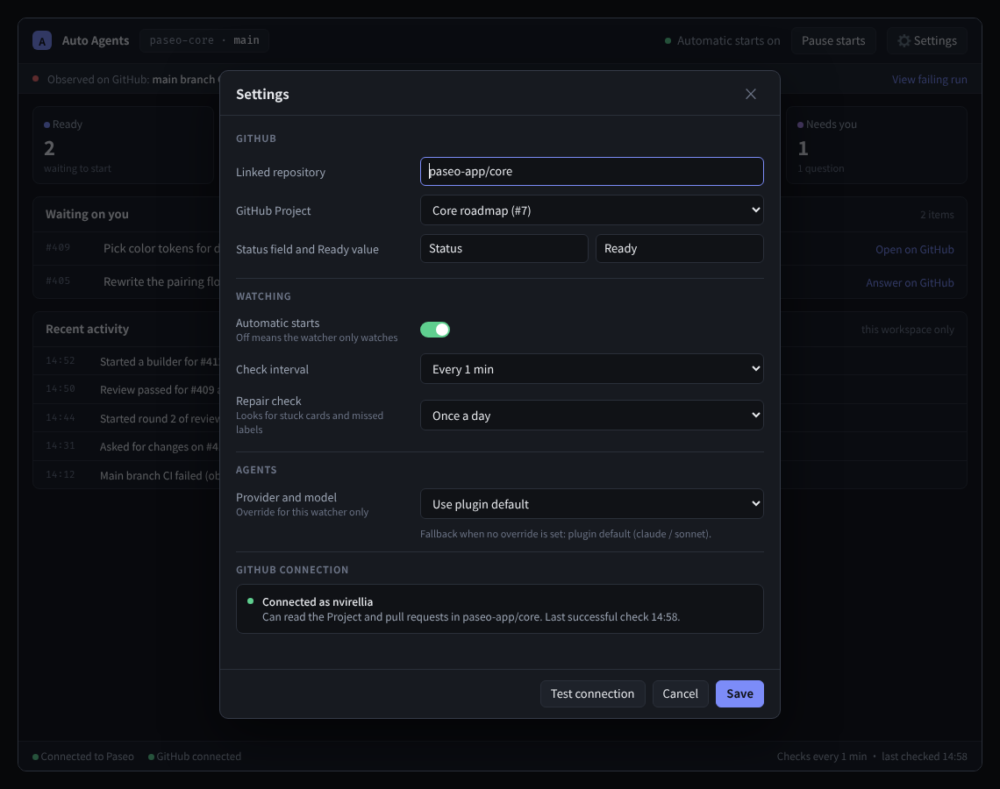

# Design: paseo-nstack

Issue: none — direct build authorized Grill: `docs/design/_intake/paseo-nstack-grill.md` @ 2026-10-09 Prototype: `proto/paseo-nstack-clean-ui` @ `accd29a` Artifact: `docs/design/assets/paseo-nstack/panel-final.png` Scaffold: none
Glossary: `GLOSSARY.md` (+9 terms) ADRs: `docs/adr/0001-keep-orchestration-in-agents.md`
Method: mattpocock/skills @ `b0618bc` (prototype, codebase-design, domain-modeling, to-tickets)
Approval: the user approved direct implementation with “Go” and selected the final UI mix; no design PR was requested. Pin: this file's pre-implementation commit.

## 1. Problem and done

- **Done predicate:** With an enabled binding between a Paseo workspace and a GitHub repository/Project, a new supported signal starts exactly one fresh, write-enabled, auto-archived orchestrator agent in that workspace. The agent receives the signal, binding, and vendored nstack skill tree. The workspace panel shows watcher health and activity, and the started agent has one plugin timeline notice.
- **Non-goals / out of boundary:** Reimplement nstack routing, budgets, parallel limits, review rounds, overlap checks, CI-hold policy, merge policy, or worker behavior in TypeScript; merge pull requests; schedule `lessons-ledger`; use GitHub webhooks; store a PAT; require approval for each signal; expose issue cards already visible in GitHub; provide a project switcher; send operating-system notifications; publish generative-ui cards.
- **Constraints found while grounding:** Plugins run client and server code in separate runtimes. `PaseoApi` exists only in RPC and lifecycle callback contexts, so restored polling waits for the first such callback; opening the panel or a host lifecycle event supplies it. Agent creation requires an explicit provider selector; one plugin default is therefore required, with an optional workspace override. GitHub Project state needs GraphQL; repository, pull-request, checks, and comments need REST. The host `gh` login supplies the token, which is never persisted. Server cleanup must stop timers and owned I/O. Tests are real isolated-daemon E2E only; no unit tests or mocked Paseo host/provider.

## 2. Usage (caller's view, written first)

The server entry supplies deployment endpoints and delegates the entire lifecycle:

```ts
import type { PluginServerContext } from "@getpaseo/plugin/server";
import { installWatcher } from "./server/install";

export default function contribute(server: PluginServerContext) {
  return installWatcher(server, {
    github: {
      hostname: process.env.PASEO_NSTACK_GITHUB_HOST ?? "github.com",
      restBaseUrl:
        process.env.PASEO_NSTACK_GITHUB_REST_URL ?? "https://api.github.com",
      graphqlUrl:
        process.env.PASEO_NSTACK_GITHUB_GRAPHQL_URL ??
        "https://api.github.com/graphql",
    },
  });
}
```

The client registers one reusable workspace-panel type and one timeline renderer:

```tsx
export default function contribute(client: PluginClientContext) {
  const cleanups = [
    client.addWorkspacePanel({
      id: "nstack",
      title: "Automatic agents",
      icon: "Bot",
      context: "workspace",
      Component: NstackPanel,
    }),
    client.addTimelineRenderer({
      kind: "nstack-agent-started",
      version: 1,
      schema: startedNoticeSchema,
      Component: StartedNotice,
    }),
  ];
  return async () => {
    for (const cleanup of cleanups) await cleanup();
  };
}
```

Every panel call carries the exact workspace context; there is no client-side project selection:

```ts
await rpc(panelRpc, { workspaceId });
await rpc(saveSettingsRpc, { workspaceId, pluginDefaults, binding });
await rpc(checkNowRpc, { workspaceId });
```

## 3. Strategy

- **Chosen shape:** `installWatcher(server, options): PluginCleanup` is the sole server interface. It synchronously registers RPCs and lifecycle hooks, gates work on one private initialization promise, captures the first callback's host-owned `PaseoApi`, and owns scheduling and shutdown. **Interface depth:** one installation call hides state validation, authentication, polling, signal normalization, persistence, agent creation, recovery, and timeline recording. **Seams:** shared Zod RPC contracts separate client transport from the watcher; configurable GitHub endpoints let production and E2E exercise the same HTTP implementation. Private signal collectors normalize GraphQL Project changes, REST repository activity, and timed repair checks; they are a real internal seam because three source forms already exist.
- **Alternatives (design it twice):**
  - Generic `request/close` module under a separately constructed Paseo client — minimal surface, rejected because this SDK exposes no authenticated daemon client configuration at plugin setup.
  - Public `Nstack` class with `bind`, panel, CRUD, discovery, pause, and check methods — explicit and extensible, rejected because it duplicates the RPC-shaped surface and lets the entry coordinate lifecycle ordering.
  - Install-only deep module — chosen because handlers remain one-line private adapters and callers cannot bypass initialization, persistence, duplicate protection, or cleanup.
  - Native or hybrid TypeScript orchestration — rejected because it creates a second nstack policy engine that can drift from the shipped skills.
  - One persistent agent per binding — rejected because independent signals would share growing context and block one another.
- **Tradeoffs accepted:** Polling adds bounded latency and GitHub API traffic but avoids webhook provisioning. The watcher cannot start after a cold plugin reload until one RPC or lifecycle callback supplies `PaseoApi`; health makes that limitation explicit. A single versioned JSON document is simpler than a database but requires serialized atomic writes and bounded activity history. Started-agent creation cannot be transactionally committed with JSON, so a persisted launch intent, stable agent ID, and stable idempotency key are reconciled after ambiguous failures.
- **Decisions:** D1 watcher only; D2 full signal set; D3 one fresh agent per signal; D4 skills own worker/review policy; D5 one binding per workspace; D6 `gh` token plus direct REST/GraphQL; D7 enabling is standing permission with workspace and global pause; D8 exact-duplicate protection only; D9 one plugin provider/model default with workspace override; D10 hourly repair check with override/off; D11 plugin id `paseo-nstack` and all nstack skills vendored; D12 workspace panel plus started-agent timeline notice; D13 no issue cards or project switcher and settings in a modal; D14 14-code-file and 1,300-LOC budget; D15 direct branch build and real E2E; D16 every panel and binding is keyed by `workspaceId`; D17 one deep installation interface.
- **Prototype verdict:** “What should the workspace dashboard show without duplicating GitHub or nstack policy?” → one no-card workspace dashboard with stage counts, “Waiting on you”, recent activity, connection status, and watcher-owned settings in a modal (`proto/paseo-nstack-clean-ui` @ `accd29a`).



<sub>Source: `docs/design/assets/paseo-nstack/panel-final.png`; prototype `proto/paseo-nstack-clean-ui` @ `accd29a`.</sub>

- **Design-proposed:**
  - **P1 Initial synchronization:** Dispatch currently Ready Project items once. Seed PR, CI, review, and comment cursors without replaying historical activity; the repair check covers stale or missed work.
  - **P2 Signal identity:** A handled-signal key includes binding ID, signal kind, GitHub subject identity, and occurrence version such as status update time, head SHA, conclusion, comment ID, or repair window.
  - **P3 Ready authorization:** An enabled binding is standing permission to act on a currently Ready item. The prompt states that polling cannot identify the Project field-change actor; human comments and commands are still filtered to the login returned by GitHub `/user`.
  - **P4 Launch recovery:** Persist intent, stable agent ID, stable idempotency key, and event labels before creation. Reconcile the stable ID before every create and again after an error. Configuration failures remain blocked until the effective provider/model changes. Other failures use 30-second exponential backoff capped at 15 minutes and five attempts.
  - **P5 Defaults and retention:** Poll every 60 seconds. Run repair checks hourly. Both are configurable; repair can be off. Activity history is bounded to the newest 200 entries. Exact-duplicate launch history remains available up to 50,000 records per workspace; paused signals stop at 5,000 and cursors at 50,000. A full buffer rejects the observation transaction without advancing cursors, preserving existing work until the operator resumes or rebinds.
  - **P6 Global and workspace controls:** The settings modal edits the plugin provider/model default and global automatic-start state, plus the current workspace binding and optional model override. The header pause affects only the current workspace.

## 4. Code layout (the conformance contract)

| ID  | Path or glob                                                                                                     | New/Mod | Owns                                                                                                                          |
| --- | ---------------------------------------------------------------------------------------------------------------- | ------- | ----------------------------------------------------------------------------------------------------------------------------- |
| L1  | `plugins/paseo-nstack/{paseo-plugin.json,package.json,tsconfig.json,README.md,index.server.ts,index.client.tsx}` | New     | Plugin metadata, package scripts, runtime entry wiring, operator documentation                                                |
| L2  | `plugins/paseo-nstack/shared/contracts.ts`                                                                       | New     | Zod RPC contracts, panel DTOs, binding drafts, signal/notice schemas                                                          |
| L3  | `plugins/paseo-nstack/server/install.ts`                                                                         | New     | S1 installation interface, RPC/hook registration, lazy Paseo binding, timer ownership, cleanup, private workflow coordination |
| L4  | `plugins/paseo-nstack/server/state.ts`                                                                           | New     | Versioned JSON, serialized mutations, atomic temp/write/rename, bounded history, launch intents and recovery records          |
| L5  | `plugins/paseo-nstack/server/github.ts`                                                                          | New     | `gh auth token`, authenticated REST/GraphQL, pagination, user identity, project/field discovery, health                       |
| L6  | `plugins/paseo-nstack/server/signals.ts`                                                                         | New     | Ready, PR, CI, human feedback/command, and repair collectors; cursor evolution and stable handled-signal keys                 |
| L7  | `plugins/paseo-nstack/server/spawn.ts`                                                                           | New     | Provider/mode validation, skill-tree materialization, prompt assembly, stable agent creation, labels, timeline append         |
| L8  | `plugins/paseo-nstack/{skills/nstack/**,server/skills.generated.ts,verify/skills.mjs}`                           | New     | Vendored nstack source, generated exact skill map, generation/verification command and provenance                             |
| L9  | `plugins/paseo-nstack/client/panel.tsx`                                                                          | New     | One workspace dashboard, settings modal, query keys containing `workspaceId`, pause/check/test/save actions                   |
| L10 | `plugins/paseo-nstack/client/notice.tsx`                                                                         | New     | Started-agent timeline schema renderer                                                                                        |
| L11 | `e2e/paseo-nstack.e2e.mjs`, `e2e/support/nstack.mjs`                                                             | New     | Local GitHub HTTP fixture plus real isolated daemon, real plugin RPC/agent records, reload, and browser observations          |
| L12 | `GLOSSARY.md`, `docs/adr/0001-keep-orchestration-in-agents.md`, `docs/design/**`                                 | New     | Domain language, durable architecture decision, transcript, design, and signed UI assets                                      |

**Public surface:**

- **S1** `installWatcher(server, options): PluginCleanup`
- **S2** `panelRpc` — load one workspace's binding, counts, attention rows, health, activity, and global defaults
- **S3** `saveSettingsRpc` — atomically save global defaults and the current binding, or remove that binding
- **S4** `discoverRpc` — list GitHub Projects, status fields, and Ready values for a repository
- **S5** `testConnectionRpc` — validate token, repository, Project/field/value, provider/model, and write mode without launching
- **S6** `setPauseRpc` — pause/resume one workspace or automatic starts globally
- **S7** `checkNowRpc` — run the normal observation path immediately without bypassing pause or duplicate protection
- **S8** `startedNoticeSchema` — versioned timeline data for one accepted agent start

**Allowed dependencies:** Client and server entries may import `shared/`; client modules may import React, React Native, TanStack Query, and plugin client SDK only; server modules may import Node APIs and the plugin/client server SDK; `server/install.ts` may depend on L4–L8; L5 is the only GitHub HTTP/token module; L7 is the only agent-creation module; generated skill code depends only on vendored files.

**Forbidden:** Cross-runtime imports; DOM APIs outside a dedicated web module; direct GitHub calls from the client; agent starts outside L7; nstack policy in TypeScript; persisted credentials; mock-only production seams; source comments; an alias, compatibility path, or second watcher interface.

Layout rules file: `AGENTS.md` and `skills/paseo-plugin-dev/SKILL.md`.

Incidental allowlist: `pnpm-lock.yaml`, generated `server/skills.generated.ts`, vendored `skills/nstack/**`, `test-results/**` on failure.

## 5. Complexity and budget

- **Moving parts:** One deep watcher runtime; atomic state document; one concrete GitHub client; three internal signal-source forms; one agent starter; one generated skill map; one workspace panel; one timeline renderer; one real E2E scenario file and its GitHub fixture.
- **Risks / one-way doors:** The thin-watcher split is the one-way architecture decision recorded in ADR 0001. The crash gap between JSON and daemon creation can duplicate or lose work if stable identity reconciliation is wrong. Polling can hit rate limits or miss actor metadata. A provider may not expose write mode. Vendored skills can drift unless verification is exact. **Blast-radius fact:** enabling automatic starts grants the plugin permission to create write-enabled agents in that binding's workspace; pause blocks new starts but never cancels an already-created agent.
- **Budget:** implementation code files ≤14 plus manifests/docs and vendored skill data · new implementation code files ≤14 · new public surfaces = S1–S8 · new classes/services = 1 required for launch-error classification · net non-test TypeScript/JavaScript ≤3,600 · E2E plus fixture ≤1,100 LOC · slices/issues ≤4 · external runtime dependencies = 0.
- **Tolerance:** +25% files/LOC. **Gate result:** keep. The reliability-reviewed implementation uses 11 source files, 3,589 non-test lines, and 1,073 E2E/fixture lines. The first grounded re-estimate was 3,200/650; recovery, retry, pagination, and corruption scenarios added 469 source lines and 456 executable-test lines without changing the public surface or architecture.

## 6. Behavior scenarios

- **B1** WHEN a valid enabled workspace binding is saved and a Project item is currently Ready, THE SYSTEM SHALL start one fresh write-enabled auto-archived orchestrator agent in that workspace with the normalized signal, binding, and vendored skill path, then record one started-agent timeline notice — evidence: real isolated-daemon E2E observing the agent title, workspace, stable signal label, plugin state, and timeline.
- **B2** WHEN the same signal occurrence is observed by repeated polls, check-now, or restart recovery, THE SYSTEM SHALL not start another agent and SHALL show “already handled” or the recovered launch state — evidence: E2E repeats the fixture response and restarts the daemon while the agent count stays unchanged.
- **B3** WHEN global automatic starts or the workspace binding is paused, THE SYSTEM SHALL continue observing and reporting GitHub state but SHALL not reserve or start a new agent; resuming dispatches the buffered signals to agents that re-read current GitHub state — evidence: E2E buffers PR, CI, and command signals under workspace pause, then drains them once and toggles the global pause gate.
- **B4** WHEN a new worker PR opens or changes head, a PR merges/closes, a CI result settles, or the authenticated human posts review feedback or a recognized command, THE SYSTEM SHALL normalize that occurrence and start exactly one orchestrator agent with its subject, SHA/result/comment, actor, and URL — evidence: the real-daemon E2E drives open, head, merge, close, CI, feedback, and command transitions through the production REST client and asserts their persisted agent signal keys.
- **B5** WHEN the repair interval becomes due, THE SYSTEM SHALL start one repair-check agent for that binding and time window; when repair is off, no repair signal is produced — evidence: E2E reloads persisted state with a due repair window and observes one repair-labeled agent; the nullable interval gates repair collection and wake scheduling.
- **B6** WHEN `gh` authentication, GitHub HTTP, persisted state, provider/model validation, or agent creation fails, THE SYSTEM SHALL expose a redacted actionable health/activity error, keep the plugin process alive where safe, and recover on the next successful check without guessing a provider or creating duplicate agents — evidence: E2E covers GitHub 503/redaction/recovery, transient and corrupt state loads, stable-agent reconciliation, blocked configuration recovery, bounded retries, and launch backoff.
- **B7** WHEN the plugin or daemon reloads, THE SYSTEM SHALL restore bindings, cursors, handled signals, activity, and launch intents, then resume schedules after an RPC or lifecycle callback supplies `PaseoApi` without historical PR/CI/comment replay — evidence: isolated plugin-reload and daemon-restart E2E.
- **B8** WHEN the panel is opened in two workspaces, THE SYSTEM SHALL show independent bindings and activity keyed by each `workspaceId`, with no project switcher or issue cards; the settings modal SHALL contain watcher-owned settings only — evidence: two-workspace real-daemon assertions, real Web UI browser observation, and the signed prototype screenshot.

## 7. Slices (to-tickets; count ≤ budget `issues`; merge = permission to file)

1. **Ready work starts exactly once**
   Blocked by: none
   Delivers: A user can open one workspace panel, discover and save its GitHub binding, test the connection, run a check, and observe one Ready item start one orchestrator agent with vendored skills and a timeline notice.
   Design refs: L1–L11, S1–S5, S7–S8, B1–B2
   Seams: S2–S5/S7 RPCs through a real isolated daemon — catches runtime boundaries, persistence, GitHub fixture integration, and workspace scoping / misses later signal kinds and restart recovery; generated-skill verifier — catches vendored/generated drift / misses skill semantics.
   Verify: Serving one Ready item fails to produce exactly one correctly configured workspace agent and one notice, or repeating the response changes agent count.
   Type: AFK · Checkpoint: yes

2. **Repository activity reaches the orchestrator**
   Blocked by: slice 1
   Delivers: Pull-request open/head/merge/close, CI, and authenticated-human feedback/commands use the same exactly-once path, and their outcomes appear in stage counts, attention rows, and recent activity.
   Design refs: L2–L7, L9–L11, S2, S7–S8, B4
   Seams: GitHub fixture through production L5 plus daemon agent list — catches endpoint parsing, cursors, normalized identity, and dispatch / misses live GitHub rate-limit behavior.
   Verify: Any supported occurrence is absent, lacks required SHA/result/actor/URL context, or repeated fixture state creates another agent.
   Type: AFK · Checkpoint: no

3. **Automation survives pauses, failures, and reloads**
   Blocked by: slice 2
   Delivers: Global and workspace pause, repair scheduling/off, provider validation, redacted health, stable launch recovery, and daemon reload preserve exactly-once behavior.
   Design refs: L2–L7, L9, L11, S2–S7, B3, B5–B7
   Seams: Settings/check RPCs plus real daemon restart — catches persisted transitions, timer cleanup/restart, waiting-host state, and agent reconciliation / misses operating-system crash during the filesystem rename itself.
   Verify: A paused binding starts work, repair-off emits a signal, secrets appear in state/logs, reload replays historical activity, or an ambiguous launch creates a second agent identity.
   Type: AFK · Checkpoint: no

4. **The workspace dashboard is the complete operator surface**
   Blocked by: slice 3
   Delivers: The final no-card dashboard, settings modal, per-workspace query scoping, global defaults, pause/check/test/save actions, responsive React Native layout, plain-language activity, and started-agent timeline rendering.
   Design refs: L1–L2, L8–L12, S2–S8, B8
   Seams: Real daemon-served Web UI driven by Playwright — catches registration, workspace context, RPC wiring, visible states, and interaction / misses native rendering; `pnpm format`, `pnpm check`, and full `pnpm test:e2e` catch repository integration.
   Verify: Two workspace tabs share data, the panel reproduces GitHub cards or nstack policy controls, the modal omits required watcher settings, or the actual UI materially differs from the signed artifact.
   Type: AFK · Checkpoint: yes

Unmapped L/S/B: none.

## 8. Open questions

None.

## Amendments

- 2026-10-09: Reliability review added recoverable initialization, corrupt-state quarantine, stable-agent reconciliation, terminal and bounded launch failures, shutdown-safe scheduling, complete discovery/closed-PR pagination, comment-edit deduplication, and explicit state caps. The Project item scan remains complete because Ready detection and dashboard counts require the current board; review polling is skipped for pulls whose `updated_at` did not change.
